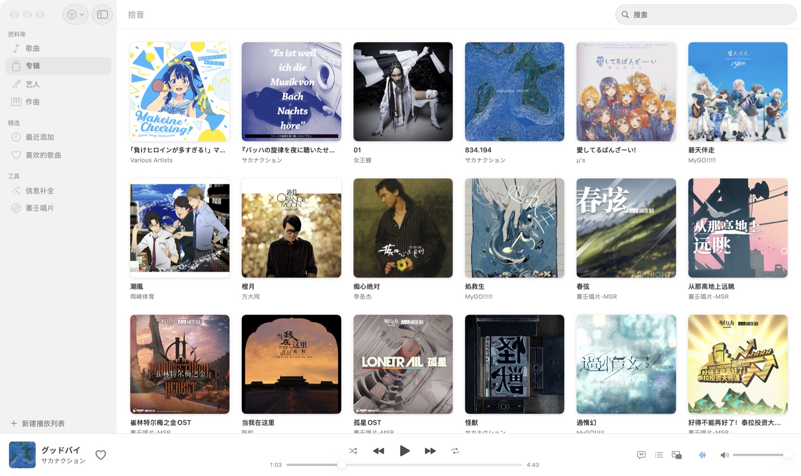
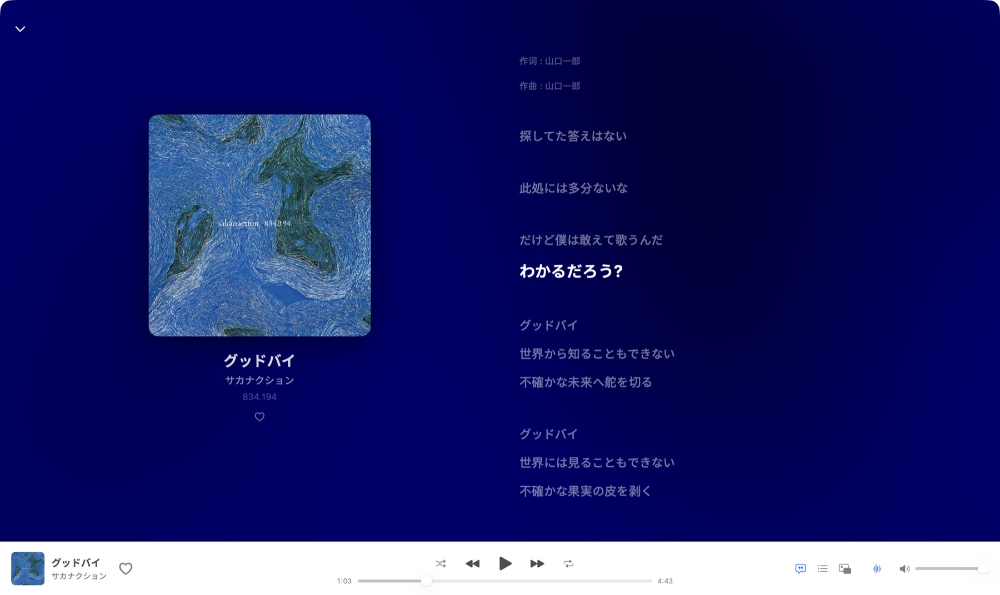
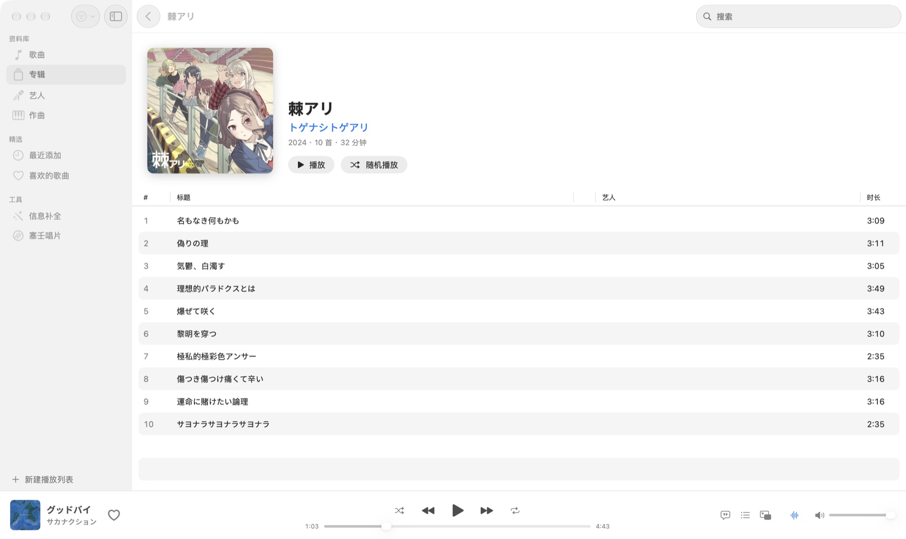
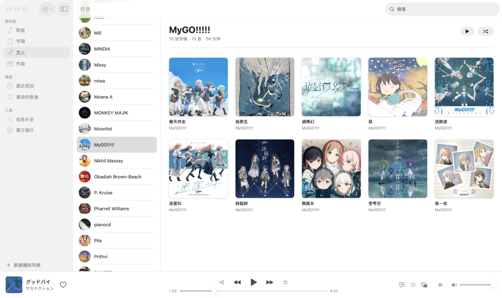
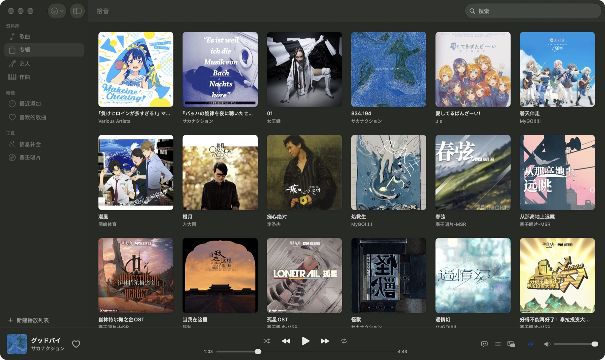
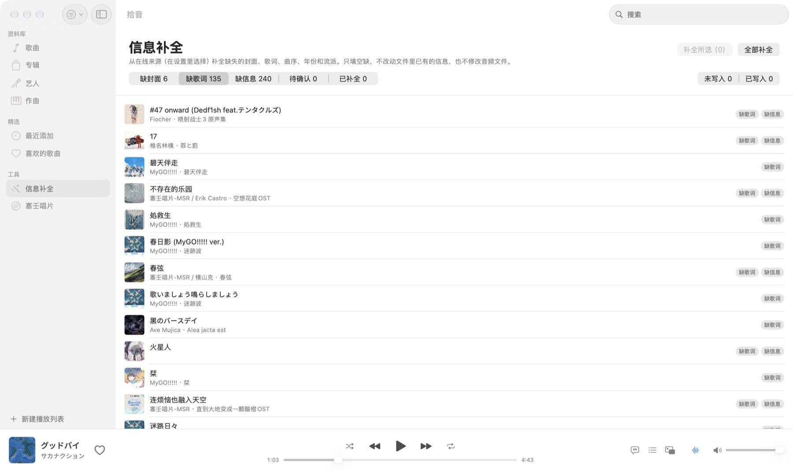
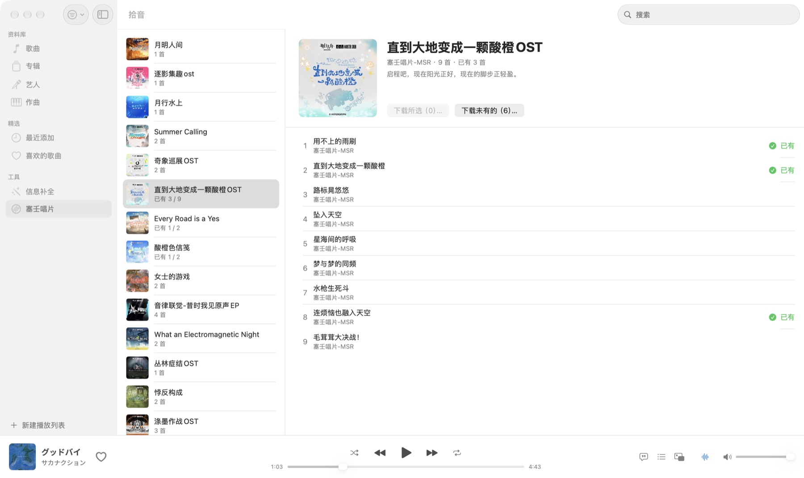

# 拾音 Shiyin

为本地无损曲库做的 macOS 音乐播放器：像 Apple Music 一样浏览，像网易云音乐一样播放。封面、歌词、作曲都能在线补全，也能把塞壬唱片的专辑直接下载进曲库。

纯 Swift / SwiftUI 原生应用，零第三方依赖，数据都在本机。



## 功能

**浏览与播放**
- 多个音乐文件夹，监听变化自动入库；支持 FLAC、MP3、M4A（AAC / ALAC）、WAV，Hi-Res 无损解码
- 歌曲、专辑、艺人、作曲、最近添加、喜欢的歌曲、播放列表；按专辑艺人 / 年份 / 流派 / 格式 / Hi-Res / 有歌词筛选，全局搜索
- 播放页：大封面、逐行滚动歌词（原文 + 翻译），点歌词跳转
- 无缝衔接、随机、循环、播放队列、迷你播放器、媒体键和控制中心
- 响度均衡（EBU R128，按曲目或按专辑），后台分析，切歌音量一致

**音质**（设置 → 播放）
- 选择输出设备（耳机、扬声器、USB 解码器…）；拔掉正在播放的设备时暂停，不会突然从扬声器外放
- 采样率跟随歌曲：有线设备的采样率随每首歌切换，省去重采样；退出时恢复原来的设置
- 原样输出：不做响度均衡、拾音音量固定 100%，音量改调设备自己的；配合采样率跟随，拾音不改动音频数据
- 播放条上的采样率标签可查看信号路径：文件格式、是否重采样、增益、音量由谁控制

**信息补全**
- 从网易云、QQ 音乐、iTunes、LRCLIB 补封面、歌词、曲序、年份、流派，作曲从歌词署名行解析；来源可在设置里开关和排序
- 文件里有网易云 `163 key` 时精确匹配，否则按标题、艺人、时长匹配，不确定的放进「待确认」
- 「选择匹配」对比各来源的候选，逐项选择替换；「编辑信息」手动修改任意字段、封面和歌词
- 默认不改文件：补全和修改存在 App 里，按音频内容关联，文件改名、移动都不会丢。需要时「写入文件」，只改标签区，先备份原标签，随时「恢复原标签」

**塞壬唱片**
- 浏览塞壬唱片官网的全部专辑，按歌名标出曲库里已有的歌
- 下载选中的歌或整张专辑：WAV 无损转成 FLAC，写好标签、封面和歌词后放进曲库

## 截图

| | |
| --- | --- |
|  |  |
| 播放页与滚动歌词 | 专辑详情 |
|  |  |
| 艺人 | 深色模式 |
|  |  |
| 信息补全 | 塞壬唱片 |

## 安装

需要 **macOS 27** 及以上、Apple 芯片的 Mac。

1. 从 [Releases](https://github.com/KyanSAMA/Shiyin/releases) 下载 `Shiyin-*.dmg`，把「拾音」拖进「应用程序」
2. 应用只做了 ad-hoc 签名，首次打开会被拦下：到「系统设置 → 隐私与安全性」点「仍要打开」，或在终端执行
   ```sh
   xattr -dr com.apple.quarantine /Applications/拾音.app
   ```
3. 在设置里添加音乐文件夹（默认 `~/Music`）

联网只发生在你打开相关页面或点补全、下载时，只发送歌名、艺人等关键词和歌曲 id。

## 音质说明

- 没打开「采样率跟随歌曲」时，所有歌都按输出设备当前的采样率播放（系统重采样，质量很好，一般听不出差别）
- 打开后，采样率不同的两首歌之间会停顿一下，同时其他应用的声音也会跟着用这个采样率；蓝牙和 AirPlay 设备的采样率由设备自己决定，无法跟随
- 信号路径只说明拾音内部做了什么；之后的系统和设备处理（扬声器音效、蓝牙编码等）不在拾音控制范围内

## 快捷键

| 按键 | 作用 |
| --- | --- |
| 空格 | 播放 / 暂停 |
| ← / → | 后退 / 前进 5 秒 |
| ⌘← / ⌘→ | 上一首 / 下一首 |
| ⌘↑ / ⌘↓ | 音量（原样输出时调设备音量） |
| ⌘F | 搜索 |
| ⌘L | 播放页 |
| ⌘N | 新建播放列表 |
| ⌥⌘U | 播放队列 |
| ⌥⌘M | 迷你播放器 |

## 从源码构建

只需 Command Line Tools（Swift 6.4）：

```sh
swift build
swift test
Scripts/bundle.sh release   # → build/LocalMusic.app
```

开发约定与自测说明见 [CLAUDE.md](CLAUDE.md)。

## 许可

[MIT](LICENSE)
